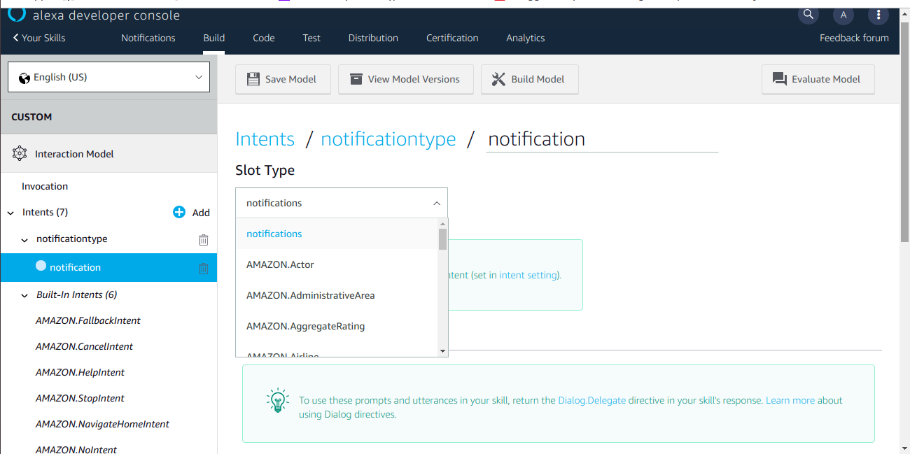

# alexa-skill-notifications

We need to create a simple Alexa Skill and AWS Lambda function, which will be used in this.

This following things briefly describes how to create Alexa Skill and its backend on AWS Lambda function. Prerequisite - accounts, created in Amazon Developer Console and AWS Management Console.

Login and open the Developer Console, navigate to Alexa section


In your Alexa Consoles — select Skills


Hit the Create Skill button,Type a Skill name. For development environment the name can be any.


Keep a Custom model as selected and hit the Create skill button. On the next page — keep the Start from scratch template selected and hit the Choose button.


On the Alexa Skill dashboard — navigate to the Invocation section, using menu on the left side. Type Skill Invocation Name — with this name users will refer to this skill when interacting with Alexa device.


Hit the Save Model button before proceeding further.Navigate to the Intents section. Intents are templates of user interaction sentences — requests, questions, answers to Alexa’s re-prompts. Each intent should contain several examples of such sentences, which have common purpose.

AS an example — following utterances should be recognized as a part of notificationtype (an intent can have any name within restrictions, mentioned above). When Alexa recognized the intent — it can respond with corresponding answer.

Intents also can contain slots(optional) — typed tags,In an utterance,when drop-down appears, enter a name for the slot in the edit box with the slot name in curly brackets ({ } and click Add.This creates a new slot for the intent.


Navigate to slot types section and add a slotype by giving a slot type name and values.


Click intent in the left-hand navigation to open the detail page for the intent.In the Intent Slots section below the sample utterances, click the Select a slot type menu.



Hit the Save Model button before proceed and build model.
Navigate to the Endpoint section. Select the AWS Lambda ARN as a Service Endpoint Type — Alexa Skill in this case would have its backend logic in an AWS Lambda function.


Your Skill ID contains an uniques identifier for this Skill. Copy it — it will be used when bind this Skill with its AWS Lambda function.

**AWS Lambda fuction:**

Login and open the AWS Management Console. In Services — hit the Lambda link.We use N.Virginia as region.


Hit the Create function button to create a new function.


Select Author from scratch option, type a function name (use only letters, numbers, hyphens, or underscores with no spaces). For this example — selected Node.js 10.x in the Runtime list. Leave the role-related as-is and hit the Create function button.


On the function dashboard — in the Designer section click add trigger option and select Alexa skills kit.This trigger needs configuration: when the Alexa Skills Kit box is selected — scroll down to the Configure triggers section and paste Your Skill ID, recently copied in the Alexa Skill dashboard (in the Endpoint section). Hit the Add button — to add the new trigger. Scroll to the top and hit the Save button — to save changes in the function.


Copy the ARN, located over the Save button — this is a unique identifier for the function.


Switch to the Alexa Skill dashboard, in the Endpoint section, and paste copied function ARN to the field Default Region. Hit the Save Endpoints button.


**Setup ASK-CLI :**

Install ASK CLI — Alexa Skills Kit command line tool. It is needed, because Alexa Skill Management API (SMAPI) is used for setup and some features, supported in SMAPI, are not supported on the Amazon Developer Portal.
```
sudo npm install -g ask-cli
```
Initialize ASK CLI. This will setup an access to API services.
```
ask init
```
During the initialization process a browser with a login page will be automatically opened. Please follow the instruction to fill in the requested AWS Access Key ID and AWS Secret Access Key.

Alternative of using ask init is to configure AWS CLI with admin user’s AWS Access Key ID and AWS Secret Access Key we will use

**Add events to skill**

With ASK CLI — proactive events need to be added to the manifest of the skill. Select one or several event schemas to be sent as notifications (they have different payload structures and properties). 

```
AMAZON.WeatherAlert.Activated
AMAZON.SportsEvent.Updated
AMAZON.MessageAlert.Activated
AMAZON.OrderStatus.Updated
AMAZON.Occasion.Updated
AMAZON.TrashCollectionAlert.Activated
AMAZON.MediaContent.Available
AMAZON.SocialGameInvite.Available
```
Get the skill manifest as a json-file
```
ask api get-skill -s your_skill_id > skill.json
```
Open this skill.json file in your favourite text editor


Add notification.write permission to the manifest section
```
"permissions": [{"name": "alexa::devices:all:notifications:write"}],
```
Add selected event names to the manifest section. In this example — two event schemas were selected: AMAZON.OrderStatus.Updated and AMAZON.MediaContent.Available. Put the Alexa Skill AWS Lambda function ARN to the endpoint property 


Update the skill with the corrected manifest (put the actual skill_id in the command)
```
ask api update-skill -s your_skill_id -f skill.json
```
Check skill status — if it is updated correct, status will contain SUCCESS
```
ask api get-skill-status -s skill_id
```
**Skill Client Id and Client Secret**

Developer Console for the Alexa Skill should contain now Client Id and Client Secret for this skill


==> Open an Alexa mobile app (iOS, Android) or Alexa web-dashboard. Open the skill and enable it.Alexa Skill should have now a section THIS SKILL NEEDS PERMISSION TO ACCESS with Alexa Notifications.
==> Hit the SETTINGS button, and the MANAGE PERMISSIONS button
==>Turn on the switch to allow notifications, hit the SAVE PERMISSIONS button to save changes

Now the Alexa device with this skill can receive Proactive events, specified in the skill manifest. Events can be sent by regular HTTP clients. For example: Postman, cUrl, IntelliJ IDEA “HTTP Client”-plugin, etc.
Here, this is a test with Postman client.

**Request a bearer token**

In the Postman — hit a “+” tab to add a new request tab, select POST as a request type and enter the bearer token API URL
```
https://api.amazon.com/auth/o2/token
```
Open the Headers tab and add a key Content-Type with a value
```
application/x-www-form-urlencoded
```


Open the Body tab and add following key-values, with selected option x-www-form-urlencoded. Put actual client_id and client_secret taken from Developer Console, Build tab, PERMISSIONS tab (described earlier)
```
Key:"grant_type"      Value:"client_credentials"
Key:"client_id"       Value:"amzn1.application-oa2-client.a478..."
Key:"client_secret"   Value:"ef1286b2..."
Key:"scope"           Value:"alexa::proactive_events"
```


Hit the Send button with Pretty/JSON options — look at the response, which should contain the access_token:


This bearer token should accompany each requests to the event API. This API has separate endpoints for three regions, and also development and production environments. With development environment endpoints events will not be send to real customers, it is made for testing purpose:

**Development**

https://api.amazonalexa.com/v1/proactiveEvents/stages/development (North America)
https://api.eu.amazonalexa.com/v1/proactiveEvents/stages/development (Europe)
https://api.fe.amazonalexa.com/v1/proactiveEvents/stages/development (Far East)

**Production**

https://api.amazonalexa.com/v1/proactiveEvents/ (North America)
https://api.eu.amazonalexa.com/v1/proactiveEvents/ (Europe)
https://api.fe.amazonalexa.com/v1/proactiveEvents/ (Far East)

**Send Proactive notification**

In the Postman application — hit another “+” tab to add a new request tab, select POST as a request type and enter the development event API URL

```
https://api.amazonalexa.com/v1/proactiveEvents/stages/development
```
Open the Headers tab and add a key Content-Type with a value

```
application/json
```
Add another key Authorization with a value

```
Bearer Atc|...
```
Where “Atc|…” is a value from the access_token property of the response from bearer token API, received earlier.


Open the Body tab and add event’s json-content, with the selected option raw:

```
{
  "timestamp": "2019-09-18T10:12:01.00Z",
  "referenceId": "unique-id-of-this-event-instance-abc123456789",
  "expiryTime": "2019-09-18T14:00:00.00Z",
   "event":  {
      "name": "AMAZON.MediaContent.Available",
      "payload": {
        "availability": {
          "startTime": "2019-09-18T20:00:00Z",
          "provider": {
            "name": "localizedattribute:providerName"
          },
          "method": "AIR"
        },
        "content": {
          "name": "localizedattribute:contentName",
          "contentType": "EPISODE"
        }
      }
    },
     "localizedAttributes": [
      {
        "locale": "en-US",
        "providerName": "Alexa Events Example",
        "contentName": "Some event"
      }
    ],
   "relevantAudience": {
    "type": "Multicast",
    "payload": {}
   }
}
```


Hit the Send button. If the bearer token and event content are correct — the respond-code will be 202 (Accepted) and the content-length is zero (no respond-body). Turned on Alexa device makes the notification sound and start blinking.

To read notifications — ask, “Alexa, what are my notifications?” or “Alexa, what did I miss?”, and all notifications, collected by this time, will be pronounced.


