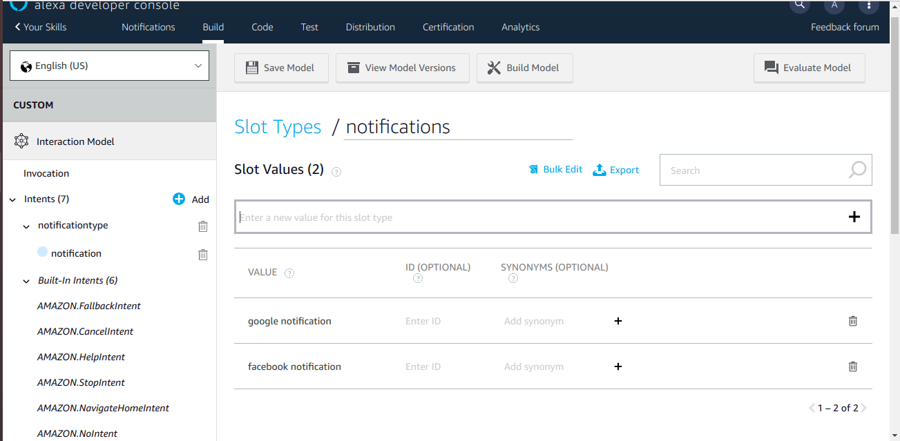

# alexa-skill-notifications

We need to create a simple Alexa Skill and AWS Lambda function, which will be used in this.

This following things briefly describes how to create Alexa Skill and its backend on AWS Lambda function. Prerequisite - accounts, created in Amazon Developer Console and AWS Management Console.

Login and open the Developer Console, navigate to Alexa section

In your Alexa Consoles — select Skills

Hit the Create Skill button,Type a Skill name. For development environment the name can be any.

Keep a Custom model as selected and hit the Create skill button. On the next page — keep the Start from scratch template selected and hit the Choose button.

On the Alexa Skill dashboard — navigate to the Invocation section, using menu on the left side. Type Skill Invocation Name — with this name users will refer to this skill when interacting with Alexa device.

Hit the Save Model button before proceeding further.

Navigate to the Intents section. Intents are templates of user interaction sentences — requests, questions, answers to Alexa’s re-prompts. Each intent should contain several examples of such sentences, which have common purpose.

AS an example — following utterances should be recognized as a part of notificationtype (an intent can have any name within restrictions, mentioned above). When Alexa recognized the intent — it can respond with corresponding answer.

Intents also can contain slots(optional) — typed tags,In an utterance,when drop-down appears, enter a name for the slot in the edit box with the slot name in curly brackets ({ } and click Add.This creates a new slot for the intent.

